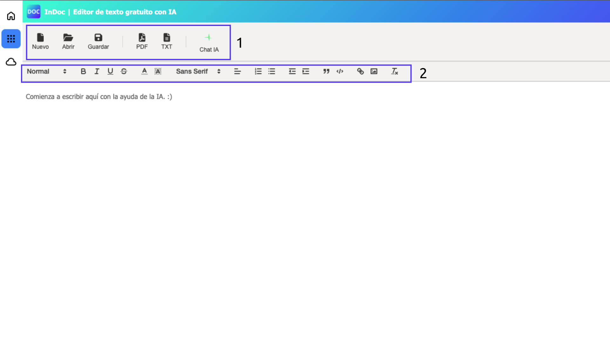
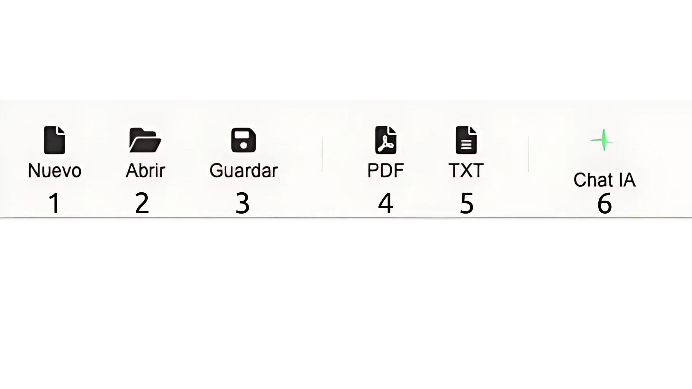
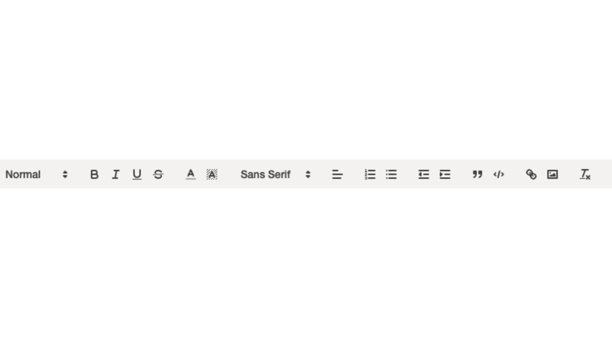

Edita texto como un profesional, siendo libre.

# Bienvenido a InDoc. 
Hemos diseñado InDoc para que te resulte útil y fácil de usar.  
Puedes editar texto formateado de forma sencilla y exportarlo a PDF o TXT.  
Además, puedes guardarlo para abrirlo y editarlo en otro momento.  

## Vista general. 
.    
1. **Barra de fichero e IA**: Desde aquí podemos gestionar el fichero, lo veremos más adelante.  
2. **Barra de formato**: Formatea el texto desde esta barra.  
   
## 1. Barra de fichero e IA. 
.   
1. **Nuevo**: Crear un nuevo documento
2. **Abrir**: Abre un documento guardado en la memoria del navegador.
3. **Guardar**: Guarda un documento en la memoria del ordenador para que se pueda volver abrir en InDoc.
4. **PDF**: Exporta el documento creado a .PDF
5. **TXT**: Exporta el documento creado a .TXT
6. **Chat IA**: Aumente su productividad con el chat de inteligencia artificial integrado en InDoc

## 2. Barra de formato.  
.  
(Contando de izquierda a derecha) 
1. **Tipo de texto**: Si es un encabezado o texto normal
2. **Negrita**
3. **Cursiva**
4. **Subrayado**
5. **Tachado**
6. **Color de letra**
7. **Color de resaltado**
8. **Tipo de letra**
9. **Alineación**
10. **Lista numerada**
11. **Lista de viñetas**
12. **Disminuir sangría**
13. **Aumentar sangría**
14. **Cita**
15. **Código**
16. **Enlace**
17. **Imagen**
18. **Borrar formato**: Elimina todo el formato al texto seleccionado
