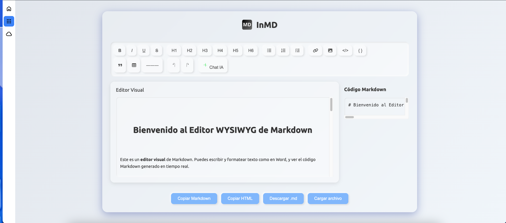
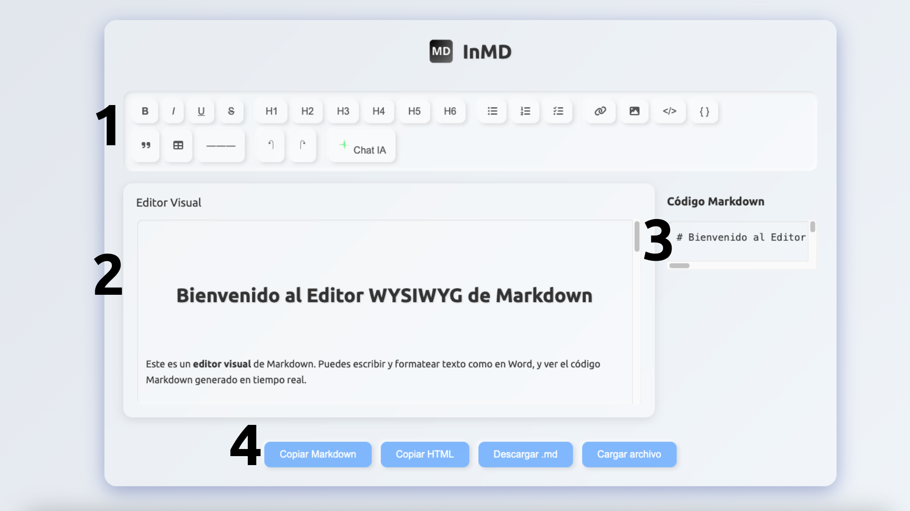
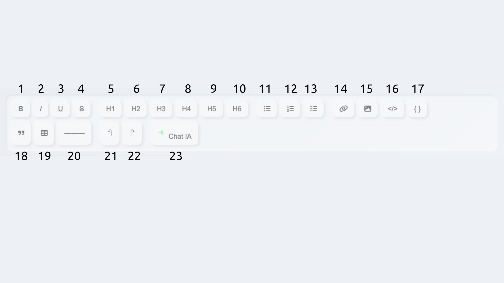
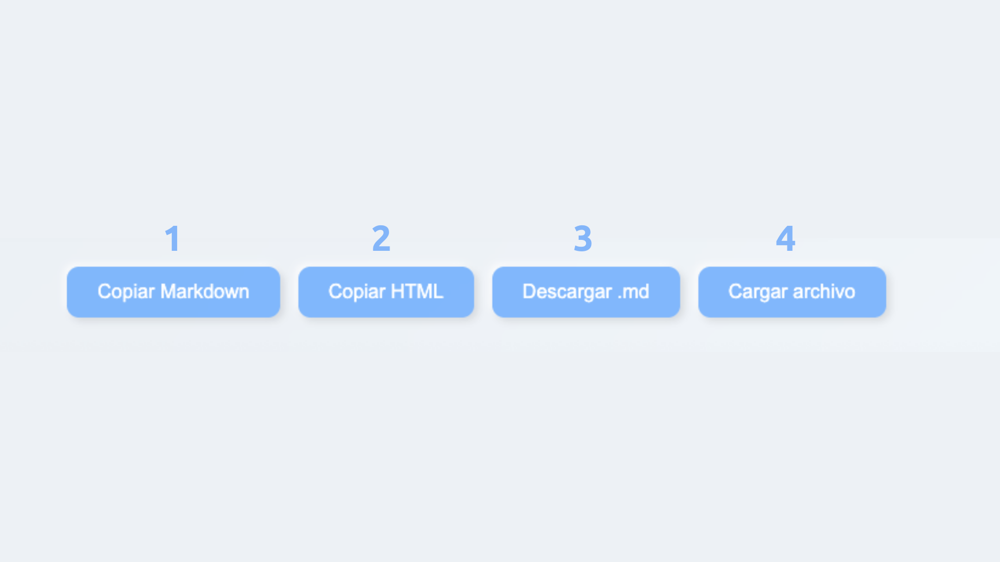

Edite Markdown como si estuviera en Word. 

# Bienvenido al primer editor visual de código abierto de markdown. 
InMD es un editor de MD visual, en el que Ud. escribe viendo el texto ya formateado y sin editar el código directamente.  
. 

# Partes del editor. 
.  

 ## 1. Barra de herramientas. 
 Desde la barra de herramientas Ud. puede dar formato al texto que está escribiendo.  
 Ya sea que desee insertar negrita o prefiera una modesta cursiva, InMD cubre sus necesidades.  
 A continuación se muestra cada botón con su descripción:
 .  
 1. **Negrita**
 2. **Cursiva**
 3. **Subrayado**
 4. **Tachado**
 5. **Título**: Añade un título de primer nivel
 6. **Subtítulo**: Añade un título de segundo nivel
 7. **Encabezado 3**: Añade un título de tercer nivel
 8. **Encabezado 4**: Añade un título de cuarto nivel
 9. **Encabezado 5**: Añade un título de quinto nivel
 10. **Encabezado 6**: Añade un título de sexto nivel
 11. **Lista de viñetas**: Añade una lista sin orden numérico
 12. **Lista numerada**: Añade una lista por orden numérico
 13. **Lista de tareas**: Añade una lista con cajas de check seleccionables
 14. **Enlace**: Añade un enlace ya sea nuevo o al texto seleccionado
 15. **Imagen**: Inserta una imagen en línea (debe subirla a un servidor de imagenes público)
 16. **Añadir código en línea**: Añade un fragmento de código sin saltar de líena
 17. **Añadir bloque de código**: Añade un bloque de código en una líena nueva
 18. **Cita**: Formatea el texto para que se vea en formato cita
 19. **Tabla**: Añade una tabla de 3x3 (debe tocar el código para añadir más celdas/columnas)
 20. **Deshacer**
 21. **Rehacer**
 22. **Chat con IA**: Experimente un aumento de su productividad con el chat de IA de Inled AI. Pídale a la IA que le de un texto e insértelo directamente en el editor. Es necesario tener un navegador compatible con [WebGPU](https://caniuse.com/webgpu)

## 2. Editor de texto visual. 
Olvídese de tocar código para crear un precioso documento en markdown.  
El editor visual es el lugar donde Ud. edita el documento como si de un Word se tratara.  

## 3. Código markdown. 
Aún así puede visualizar, si así lo desea, el código markdown que está generando en la ventana lateral.  
Al desplazarse en el editor visual se desplaza de manera sincronizada y automática en el editor de código.  

## 4. Botonera de descarga y carga. 
Desde aquí Ud. puede copiar y cargar en diferentes formatos.
. 
1. **Copiar markdown**: Copia al portapapeles el código markdown generado
2. **Copiar HTML**: Copia al portapapeles el código HTML generado
3. **Descargar .md**: Descarga el código markdown en un documento de extensión markdown (.md)
4. **Cargar archivo**: Cargue un archivo markdown para continuar editándolo
   
## Conclusiones. 
Esperamos que disfrute y experimente la productividad sin límites, sin registros ni costes.
Un saludo.