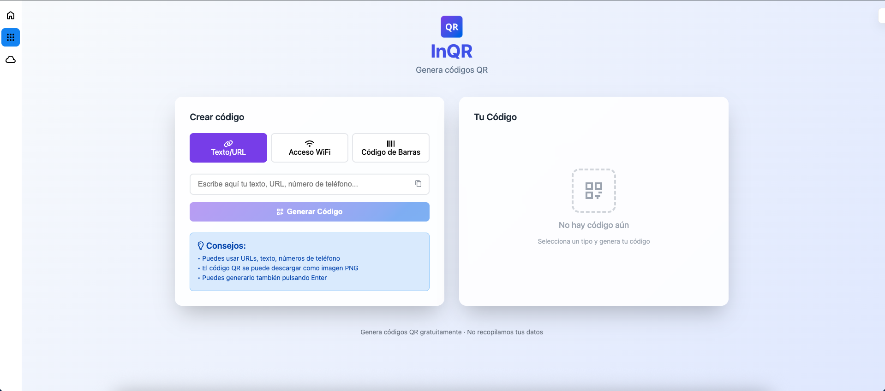
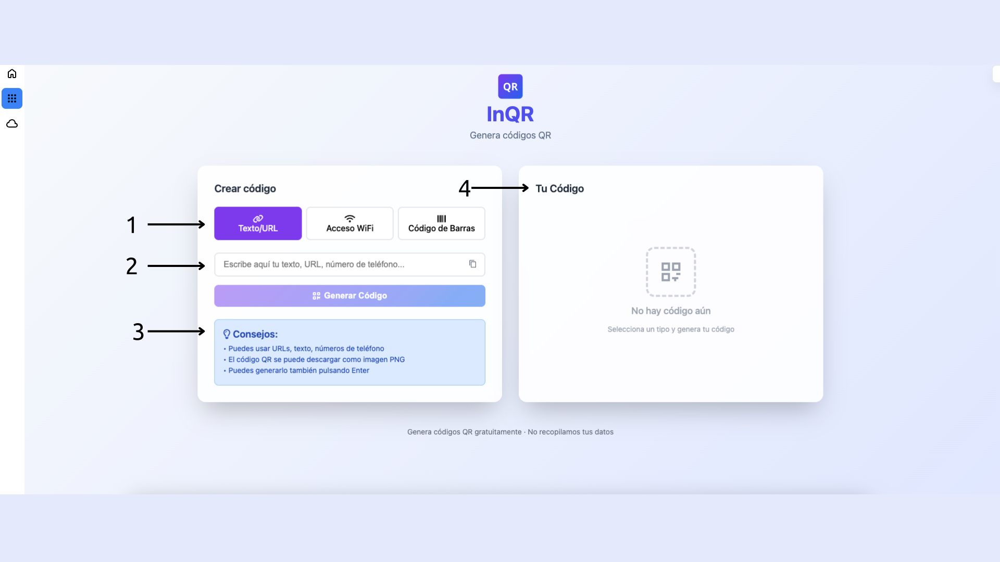
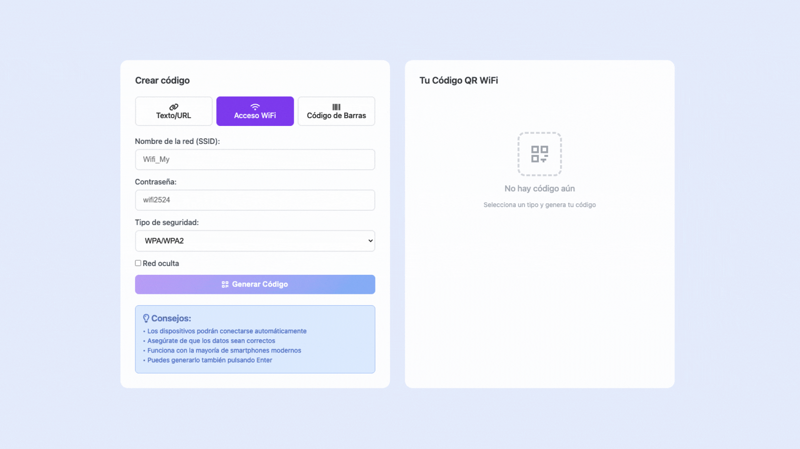

De forma segura y privada.  

# Descubra el generador de QR's online, libre y seguro.  
Una de las formas más comunes de entrada de virus informáticos son los códigos QR.  
Debemos estar seguros de que la página que usamos nos genera un código que lleva realmente a la web que deseamos y no nos lleva antes por una página que nos inyecta un precioso virusete.  

Además, las páginas de calidad normalmente piden registro o una tasa de suscripción.  

Es por ello que presentamos InQR, un generador de códigos QR **seguro**, **privado** y **libre**.  

El código fuente del generador está disponible en la plataforma de publicaciónde código Github.  
Si está interesado en verificar la seguridad del generador, puede acceder a [https://github.com/Inled-Group/inqr](https://github.com/Inled-Group/inqr) para revisar el código. Si le gusta, por favor, regálenos una Star en Github. Gracias.  

## Visión general. 
Cuando Ud. abre InQR se topa con algo como esto: 
.  
Vamos a diferenciar varias partes de InQR antes de ponernos a ello:  
.
1. **Selector de tipo de código**: Seleccione el tipo de código a generar
2. **Información para la generación**: Inserte aquí la información que se le solicite para poder generar el código
3. **Consejos**: Esta pestaña le da consejos para aumentar su eficacia con InQR
4. **Resultado**: Aquí se mostrará el código generado.  

Hay diferentes tipos de códigos que se pueden generar: 

## 1. QR general 
Genera un código QR que lleva a un sitio web, a un teléfono, a un mail o que muestra un texto
.  
Deberá rellenar la información que se le solicita y pulsar en **Generar código**.  

## 2. QR de acceso a Wifi. 
Genera un código QR que ingresa al usuario que lo lee en una red Wifi específica.
.  
1. Insertar el nombre de la Wifi
2. Introducir la contraseña de la Wifi
3. Seleccionar el tipo de seguridad que tiene la wifi
4. En caso de que sea una red oculta, marque esta casilla

## 3. Código de barras. 
Introduzca el contenido que desea que se aloje en el código de barras.

