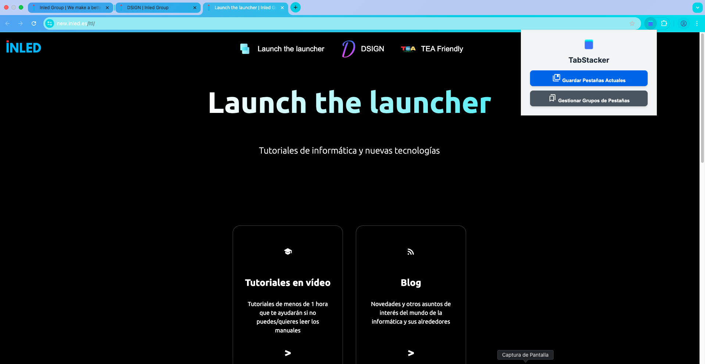
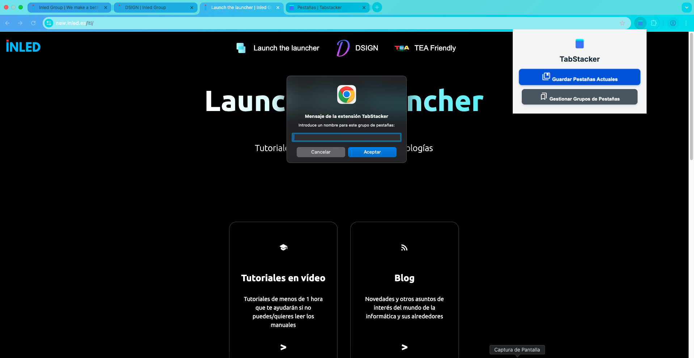
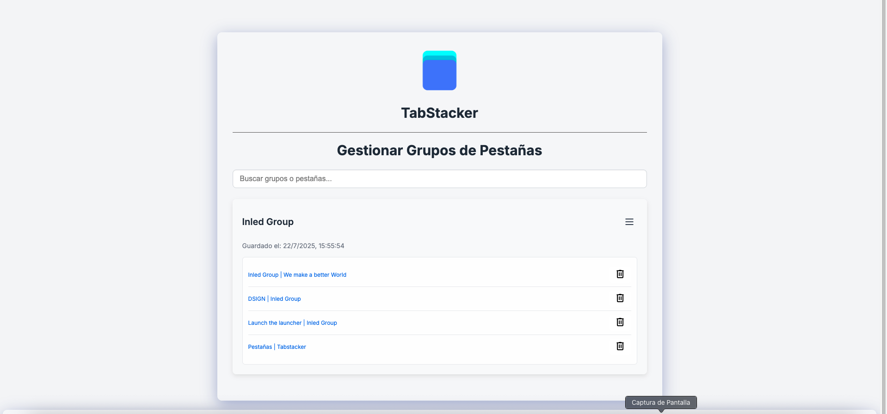
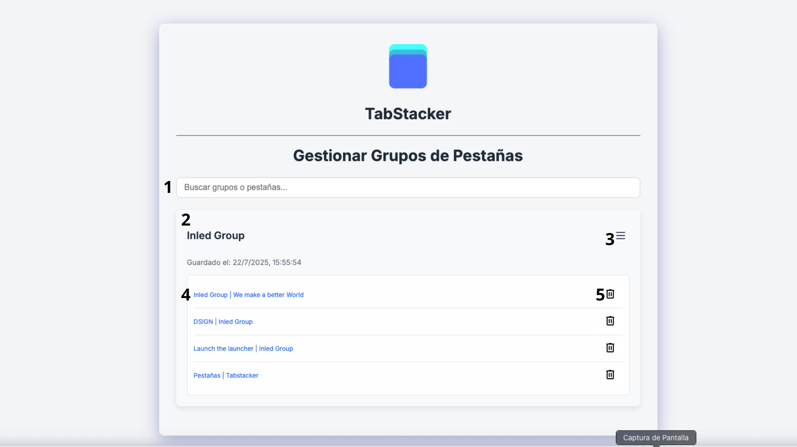
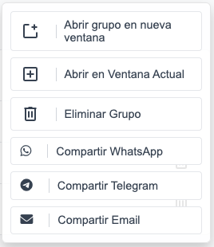

# Tabstacker: un guardapestañas personal  
Tabstacker es un guardapestañas personal para navegadores basados en Chrome.  
Tabstacker le permite guardar, compartir, abrir y navegar entre pestañas.  

## Guardar y ver pestañas  
  
Como vemos, al pulsar en el icono de TabStacker podemos: 
- Guardar las pestañas actuales
- Acceder al portal de pestañas guardadas

Cuando pulsamos en Guardar Pestañas Actuales nos aparece lo siguiente:
   
Una ventana superpuesta del navegador solicitando el nombre para el grupo de pestañas. Deberemos indicar el nombre con el que queremos agrupar las pestañas.

## Gestionar pestañas  
 
Esta es una vista general de la página de pestañas.
 
1. Búsqueda inteligente
2. Grupo de pestañas
3. Acciones para el grupo
4. Pestaña (se puede abrir pulsando en el nombre)
5. Borrar pestaña individual

### Acciones grupo de pestañas
   
Vamos a ver sus características de arriba a abajo:
1. **Abrir grupo en ventana nueva**: Abre todas las pestañas del grupo en una nueva ventana
2. **Abrir en ventana actual**: Abre las pestañas del grupo en la ventana actual y cierra las que no son del grupo
3. **Eliminar grupo**: Elimina el grupo
4. **Compartir por WhatsApp**: Permite enviar el grupo de pestañas por WhatsApp
5. **Compartir por telegram**: Permite enviar el grupo de pestañas por Telegram
6. **Compartir por correo**: Permite enviar el grupo de pestañas por correo

## Privacidad de Tabstacker  
Tabstacker es 100% privado y puede asegurarse visitando el [repositorio de Github](https://github.com/Inled-Group/tabstacker).  
No espiamos lo que hace ni obtenemos el más mínimo dato.  
Nos importa la privacidad y hay que hacer al prójimo lo que queremos que nos hagan a nosotros.